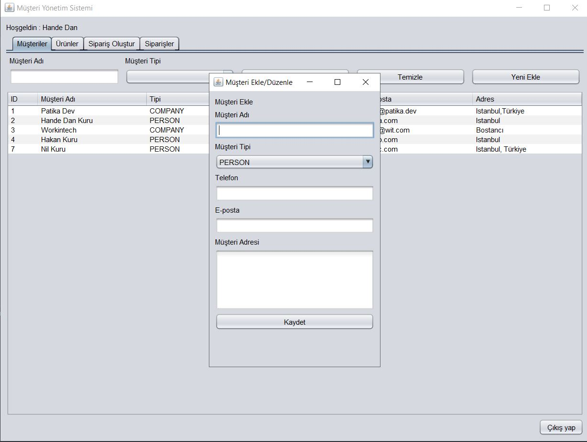
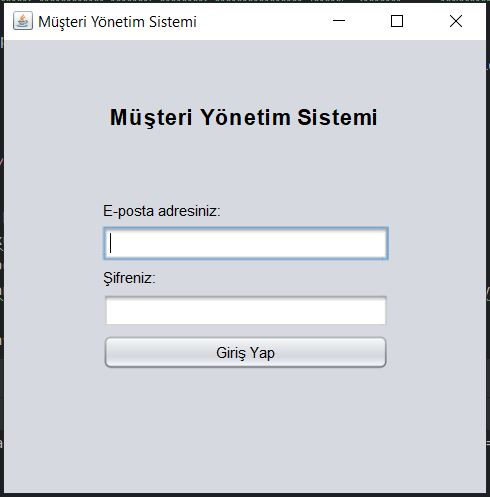
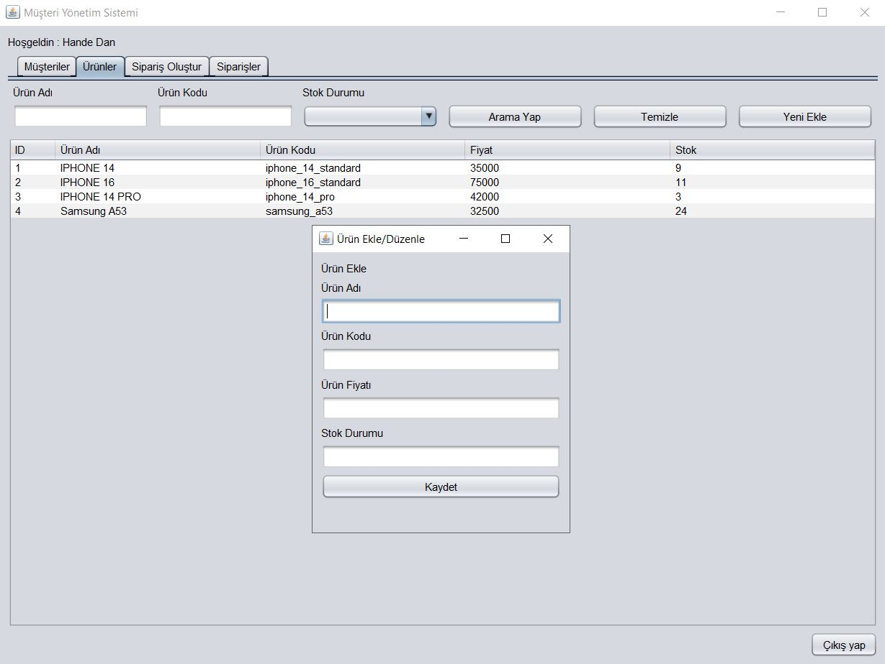
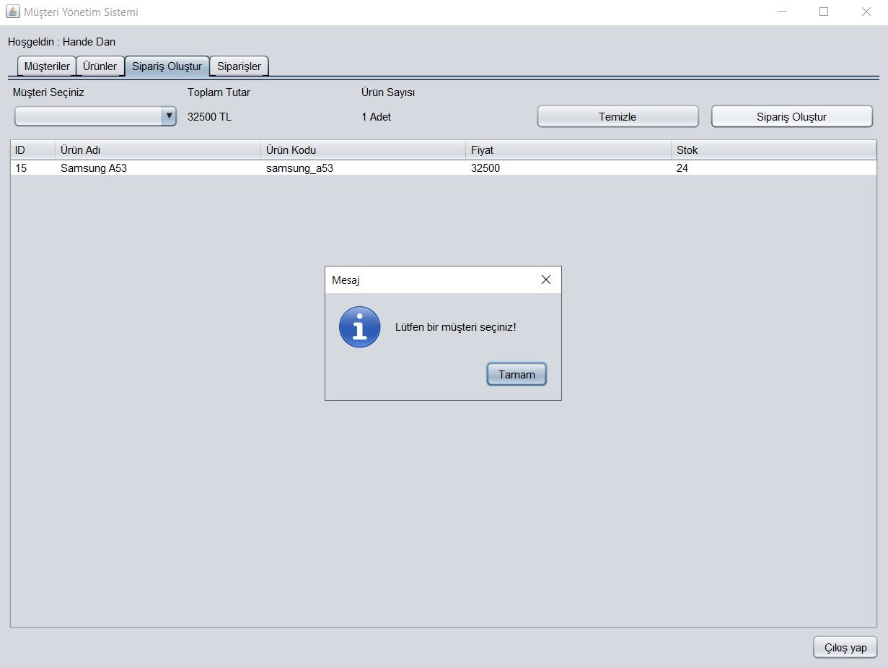
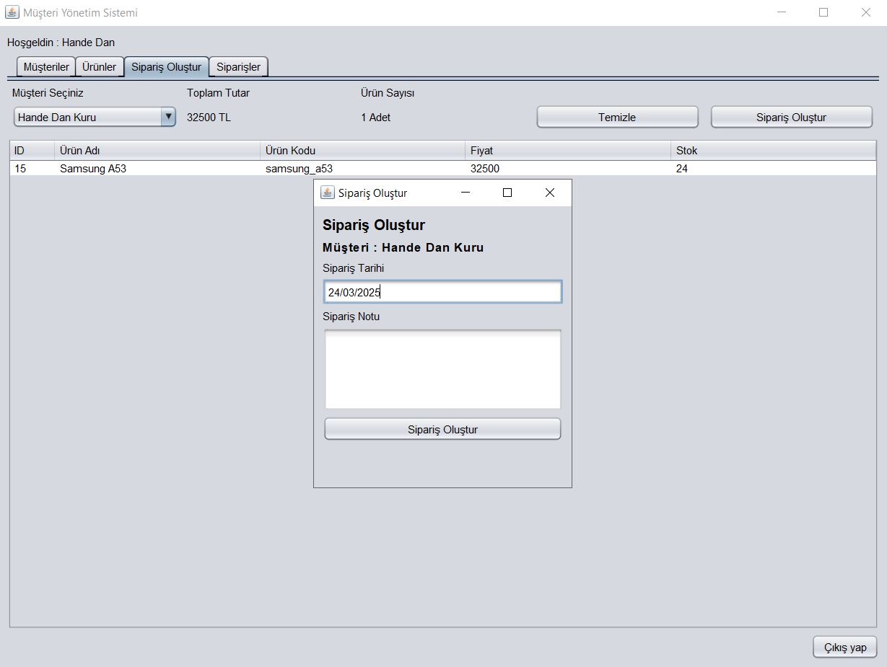
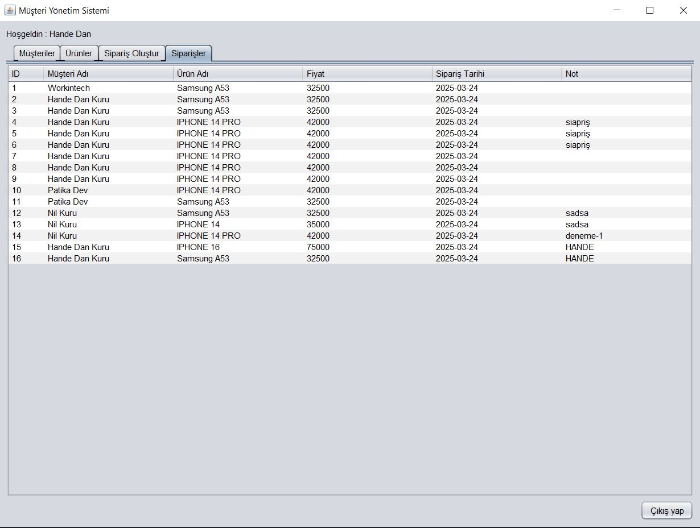

# Order Management System with Java & Swing UI

## 📌 Proje Özeti / Project Overview
Bu proje **Swing UI**, **MySQL** ve **IntelliJ IDEA** kullanılarak geliştirilmiştir.  
Kurumsal ve katmanlı mimari yapısına uygun olarak tasarlanmış olup, temiz kod prensipleri esas alınmıştır.

This project was developed using **Swing UI**, **MySQL**, and **IntelliJ IDEA**.  
It is designed based on enterprise and layered architecture principles, following clean code practices.

---

## 🚀 Teknik Detaylar / Technical Details

✔ **Singleton** design pattern ile **veritabanı bağlantısı** yönetildi.  
✔ **Katmanlı mimari** kullanıldı.  
✔ **Özel yardımcı (helper) sınıflar** oluşturuldu.  
✔ **UI bileşenleri** mantıklı gruplara ayrıldı, **Dashboard UI** temiz kod prensibiyle metodlara bölündü.

✔ **Database connection** is managed using the **Singleton** design pattern.  
✔ **Layered architecture** was implemented.  
✔ **Custom helper classes** were created.  
✔ **UI components** were grouped logically and **Dashboard UI** was modularized for clean code.

---

## 🎯 Özellikler / Features

- 🔹 **Giriş Yapma**
- 🔹 **Login System**

- 🔹 **Müşteri Yönetimi (Customer Management)** – Ekleme, silme, güncelleme, arama ve filtreleme
- 🔹 **Customer Management** – Add, delete, update, search, and filter customers

- 🔹 **Ürün Yönetimi (Product Management)** – Ekleme, silme, güncelleme, arama, filtreleme, sepete ekleme
- 🔹 **Product Management** – Add, delete, update, search, filter, and add products to cart

- 🔹 **Sipariş Oluşturma (Order Creation)** – Müşteri seçimi, sıfırlama, sipariş oluşturma, toplam tutar ve ürün sayısı görüntüleme
- 🔹 **Order Creation** – Select customer, reset order, create an order, view total amount and product count

- 🔹 **Sipariş Görüntüleme (Order Tracking)** – Siparişleri tarih bazlı görüntüleme
- 🔹 **Order Tracking** – View orders with timestamps 

- 🔹 **Oturumu Kapatma (Log Out)** – Kullanıcının oturumu güvenli şekilde sonlandırması
- 🔹 **Log Out** – Securely terminate user session
